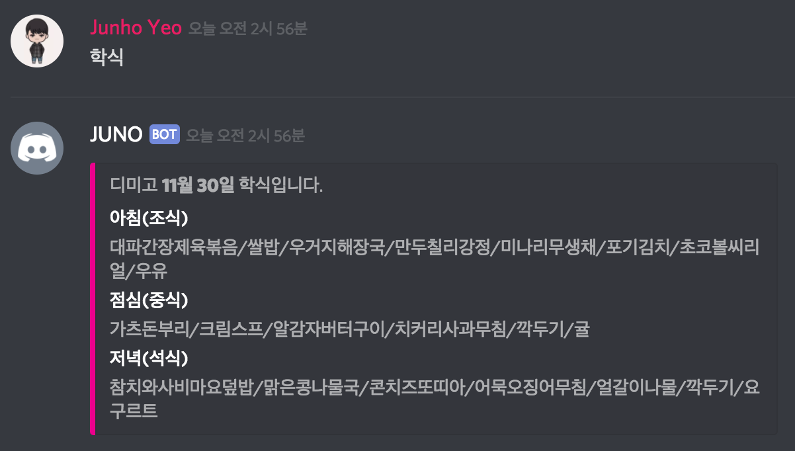
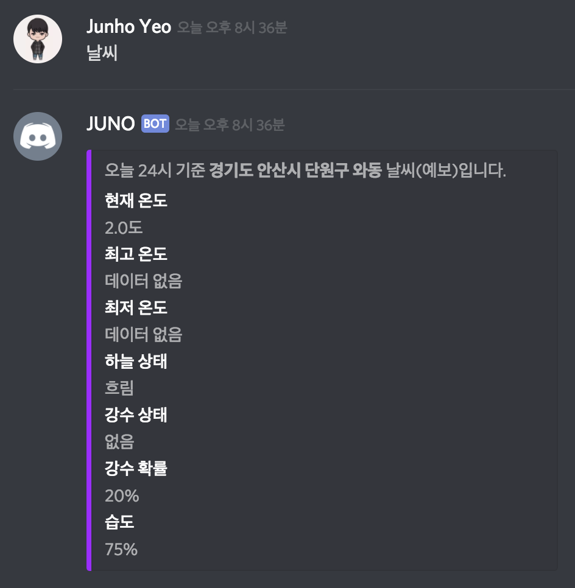

# JUNO
디미고 디스코드 챗봇

## 학식


### Usage
`학식` 또는 `급식`

### Result
```
디미고 11월 30일 학식입니다.
아침(조식)
대파간장제육볶음/쌀밥/우거지해장국/만두칠리강정/미나리무생채/포기김치/초코볼씨리얼/우유
점심(중식)
가츠돈부리/크림스프/알감자버터구이/치커리사과무침/깍두기/귤
저녁(석식)
참치와사비마요덮밥/맑은콩나물국/콘치즈또띠아/어묵오징어무침/얼갈이나물/깍두기/요구르트
```

## 날씨


### Usage
`날씨`

### Result
```
오늘 21시 기준 경기도 안산시 단원구 와동 날씨(예상)입니다.
현재 온도
3.0도
최고 온도
데이터 없음
최저 온도
데이터 없음
하늘 상태
구름 많음
강수 상태
없음
강수 확률
10%
습도
65%
```
